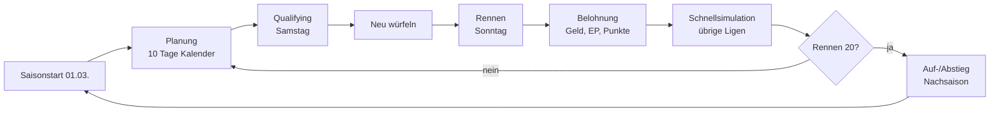

# Rennmanager – Game Design Dokument (v1.0)

2026-09-17 · @Someone

## 1. Vision und Kernloop

Ein Motorsport-Manager mit sichtbarer Rennsimulation: Draufsicht auf reale Strecken, Autos als Punkte, Zeitmessung in Tausendsteln. Der Spieler startet mit allen Werten auf 0 in Liga 20 und arbeitet sich über Fahrzeug-Upgrades, Erfahrung und Training nach oben – Abstiege gehören dazu.

**Festgelegt**

- Vereinfachte, aber nachvollziehbare Physik; Zeiten in Tausendsteln
- Rennwochenende = Qualifying (Samstag) + Rennen (Sonntag); dazwischen werden Tagesform und Eigenschafts-Zufall neu gewürfelt
- 20 Ligen × 30 Autos = 600 Autos, 20 reale Strecken pro Saison
- Nur das Rennen des Spielers wird voll simuliert; die übrigen 19 Ligen laufen nach jedem Rennwochenende im Schnellmodus
- KI-Fahrer haben dieselben Eigenschaften wie der Spieler und verbessern sich vorerst nicht
- Werteskala 0 bis 100.000, Start überall bei 0; je höher der Wert, desto langsamer die Entwicklung
- Jede Fähigkeit hat einen festen Währungstyp: Geld, Erfahrung, Zeit oder eine feste Kombination
- Oberfläche auf Deutsch



## 2. Kalender und Zeit

Zeit ist die Zahl der nutzbaren Tage zwischen den Rennen; sie wird im Tageskalender verplant.

- Erstes Rennen am ersten Sonntag ab 01.03., danach alle 14 Tage; Rennen 20 folgt 266 Tage später (Ende November)
- Pro 14-Tage-Zyklus 10 nutzbare Tage; der Rest entfällt auf Reise, Qualifying (Samstag) und Rennen (Sonntag)
- Vorsaison (01.01. bis erstes Rennen, rund 59–65 Tage) und Nachsaison (letztes Rennen bis 31.12., rund 33–39 Tage) sind voll nutzbar; der Saisonwechsel liegt am 31.12./01.01.
- Tageskalender mit Fortschritt: Tag für Tag weiterschalten oder direkt zum nächsten Rennen springen; Ereignisse werden beim Tageswechsel ausgelöst
- Nach jedem Rennen plant der Spieler, wie er Zeit, Erfahrung und Geld bis zum nächsten Rennwochenende einsetzt

**Zeitmodell: Zeit als Kapazität**

| Fähigkeitstyp | Was ein zugewiesener Tag bewirkt |
| --- | --- |
| Reine Zeit (Z) | Wert steigt kostenlos um max(+10, +1 % des aktuellen Werts) |
| Zeit + Geld/EP | Tag schaltet denselben Zuwachs frei; Geld/EP werden zusätzlich je +10-Schritt bezahlt |
| Nur Geld/EP | Sofort kaufbar, braucht keine Tage |

Jeder Tag hat zwei parallele Plätze: einen für den Fahrer (Training) und einen für die Werkstatt (Entwicklung). Ohne dieses Modell wäre Zeit bei hohen Werten nicht bezahlbar, weil bis 98.000 rund 9.800 Einzelschritte nötig sind.

## 3. Strecken und Streckenmodell

Die 20 Strecken kommen aus der [TUMFTM racetrack-database](https://github.com/TUMFTM/racetrack-database) (Lizenz LGPL-3.0): GPS-Mittellinien aus OpenStreetMap, geglättet, in Metern, mit Streckenbreite links/rechts und fertiger Ideallinie.

| Nr. | Strecke | Land | Charakter |
| --- | --- | --- | --- |
| 1 | Sakhir | Bahrain | Traktion, harte Bremszonen |
| 2 | Melbourne | Australien | Halbstadtkurs |
| 3 | Shanghai | China | Lange Gerade, enge Schnecke |
| 4 | Catalunya | Spanien | Ausgewogen, Reifenverschleiß |
| 5 | Montreal | Kanada | Schikanen, Bremsen |
| 6 | Spielberg | Österreich | Kurz, Bergauf-Bremszonen |
| 7 | Silverstone | Großbritannien | Schnelle Kurven |
| 8 | Budapest | Ungarn | Eng, kaum Überholen |
| 9 | Spa | Belgien | Lang und schnell |
| 10 | Zandvoort | Niederlande | Steilkurven, eng |
| 11 | Monza | Italien | Höchstgeschwindigkeit |
| 12 | Hockenheim | Deutschland | Lange Geraden |
| 13 | Nürburgring | Deutschland | Technisch |
| 14 | Norisring | Deutschland | Kurzer Stadtkurs, Haarnadeln |
| 15 | Oschersleben | Deutschland | Kurvig, eng |
| 16 | Suzuka | Japan | Achterform, Fahrerstrecke |
| 17 | Austin | USA | Vielseitig |
| 18 | Mexiko-Stadt | Mexiko | Lange Gerade |
| 19 | São Paulo | Brasilien | Gegen den Uhrzeigersinn |
| 20 | Yas Marina | Abu Dhabi | Geraden und enge Kurven |

Monaco, Imola und Mugello fehlen im Datensatz; sie ließen sich über [bacinger/f1-circuits](https://github.com/bacinger/f1-circuits) (nur Linie, ohne Breite) nachrüsten. Die Datenqualität schwankt je Strecke laut README – vor Übernahme sichtprüfen.

**Streckenmodell**

- Linie auf 5 m Punktabstand neu abtasten; die Punkte fahren auf der Ideallinie
- Krümmungsradius je Punkt bestimmt den Segmenttyp: enge Kurve r < 60 m, Kurve 60–300 m, Gerade r ≥ 300 m
- Nur Geraden ab 100 m Länge sind Überholzonen
- 4 Sektoren gleicher Länge, Start/Ziel-Linie; Boxengasse erst mit Boxenstopps
- Kennwerte je Strecke: Länge, Überholschwierigkeit (aus Geradenanteil), Reifenverschleiß-Faktor, Wetterprofil

## 4. Rennsimulation

Nur die 30 Autos im Rennen des Spielers werden fein simuliert; ihr Tempo ergibt sich je Segmenttyp aus den Eigenschaften.

**Geschwindigkeitsmodell (vereinfacht)**

1. Enge Kurve und Kurve: Kurvenlimit steigt mit dem Radius; welche Eigenschaften wirken, zeigt die Wirkungsmatrix (Abschnitt 8)
2. Gerade: Höchstgeschwindigkeit aus Fahrzeug- und Fahrerwerten, höchstens 400 km/h in Liga 1
3. Beschleunigungs- und Bremskurve: Vorwärtsdurchlauf mit Beschleunigungsgrenze, Rückwärtsdurchlauf mit Bremsgrenze; beides eigene Eigenschaften
4. Wetter: Der Grip-Faktor senkt das Tempo jedes Autos
5. Reifen: Verschleiß senkt das Tempo und erhöht die Fehlerquote; vorerst keine Boxenstopps (später: frische Reifen machen wieder schneller)
6. Ergebnis: Geschwindigkeitsprofil je Auto und Session → Position der Punkte über die Zeit

**Fehler, Unfälle, Defekte**

- Fehler: Wahrscheinlichkeit aus den Eigenschaften, skaliert mit dem Wetter; kosten einmalig Zeit
- Unfälle: sehr selten und nur bei weniger als 30 m Abstand; mal scheidet ein Auto aus, mal beide; je Rennen wird eine Obergrenze von 0–5 Ausfällen gewürfelt
- Defekte: selten, aber häufiger als Unfälle; senken das Tempo bis zur Reparatur (Abschnitt 14); im Ranking markiert, Details per Mouseover

**Überholen**

- Nur auf Geraden (Überholzonen), nie in Kurven
- Voraussetzung: Abstand unter 0,05 s und mindestens 2 km/h Tempovorteil
- Sonst bleibt das schnellere Auto dahinter und fährt dessen Tempo
- Erfolgschance aus Überholen (Angreifer) gegen Verteidigen (Verteidiger), Streckenfaktor und Tempovorteil
- Keine Kollisionsphysik; bei Duellen werden die Punkte leicht seitlich versetzt

**Start**

- Aufstellung nach Qualifying, jedes Auto 5 m hinter dem Vordermann (Platz 30 steht 145 m hinter Platz 1)
- Reaktionszeit 0,100–0,300 s aus der Eigenschaft Reaktion/Start

**Qualifying**

- Jedes Auto fährt allein: ungezeitete Aufwärmrunde, danach eine gezeitete Runde
- Startreihenfolge: umgekehrter Meisterschaftsstand (Erster der Wertung fährt zuletzt); im ersten Rennen der Saison aufsteigend nach durchschnittlicher Qualifying-Fähigkeit
- Live-Einsortierung ins Ranking; Sektorzeiten mit ± in Grün/Rot gegenüber der aktuellen Bestzeit
- Eigener Zufallswurf; besonders stark zählen Motorleistung, Drehmoment, Reifen-Grip, Lenkung sowie Qualifying, Nervenstärke und Mentale Stärke (Gewichte in Abschnitt 8)

**Distanz und Zeitraffer**

- Renndistanz: Liga 20 = 100 km, je Liga +10 km, Liga 1 = 290 km; Rundenzahl = Distanz ÷ Streckenlänge, aufgerundet
- Zeitraffer 1×, 2×, 5×, 10×, 20×, 50×, 100× und Sofortergebnis

**Zeitmessung und Anzeige**

- Intern ganze Millisekunden, Linienüberfahrten interpoliert, jede Session mit Seed
- Zeiten als m:ss.mmm, ab einer Stunde als h:mm:ss.mmm
- Seitenleiste: aktuelle Positionen, Gesamtzeit des Führenden, Rückstand der anderen in s.mmm, ab 60 s als m:ss.mmm, Überrundete als „+1 Rd.“
- Sobald der Sieger im Ziel ist, beendet jedes andere Auto das Rennen bei seiner nächsten Überfahrt der Ziellinie
- Zeitenmonitor: letzte Runde, beste Runde, 4 Sektorzeiten
- Gleichstand auf die Millisekunde: vorne liegt, wer den höheren Durchschnitt der Basiseigenschaften (ohne Zufall) hat, sonst entscheidet das Los
- Darstellung: Strecke als Linie, Autos als Punkte in Teamfarbe mit Kürzel, Spieler hervorgehoben

## 5. Fahrzeug: 16 Upgrades

Fahrzeug-Setups und Kraftstoff sind entfernt; neu sind Lenkung (enge Kurven) und Kühlung (Hitze, Defekte). Legende: G = Geld, E = Erfahrung, Z = Zeit.

| Nr. | Upgrade | Wirkt vor allem auf | Währung |
| --- | --- | --- | --- |
| F1 | Motorleistung | Gerade, Beschleunigen | G |
| F2 | Drehmoment | Beschleunigen aus engen Kurven | G + Z |
| F3 | Getriebe | Beschleunigen | G + E |
| F4 | Übersetzung | Endgeschwindigkeit auf Geraden | G + E |
| F5 | Abtrieb | Schnelle Kurven | G + Z |
| F6 | Luftwiderstand | Gerade | G + Z |
| F7 | Fahrwerk | Kurven, enge Kurven | G + E |
| F8 | Bremsanlage | Bremsen | G |
| F9 | Reifen-Grip | Alle Kurven, Beschleunigen, Bremsen | G |
| F10 | Reifenhaltbarkeit | Reifenverschleiß | G + Z |
| F11 | Gewicht | Enge Kurven, Beschleunigen, Bremsen | G + Z |
| F12 | Traktion | Kurvenausgang, Start | G + E |
| F13 | Lenkung | Enge Kurven | G + E |
| F14 | Zuverlässigkeit | Defektwahrscheinlichkeit | G + E + Z |
| F15 | Elektronik | Fehlerquote, Start | G + E |
| F16 | Kühlung | Defekte, Leistung bei Hitze | G + Z |

Kraftstoff kehrt zurück, falls Boxenstopps später kommen (O5).

## 6. Fahrer: 16 Eigenschaften

Der Fahrer hat eigene Werte für enge Kurven, Kurven, Geraden, Beschleunigen und Bremsen; Streckenanpassung und technisches Feedback sind entfallen (Streckenkenntnis läuft jetzt automatisch).

| Nr. | Eigenschaft | Wirkt vor allem auf | Währung |
| --- | --- | --- | --- |
| D1 | Konzentration | Fehlerquote, v. a. späte Runden | Z |
| D2 | Ausdauer | Leistungsabfall über die Distanz | Z |
| D3 | Fitness | Kurven, Ermüdung | Z + G |
| D4 | Reaktion/Start | Reaktionszeit 0,100–0,300 s | Z + E |
| D5 | Enge Kurven | Tempo in engen Kurven | E |
| D6 | Kurven | Tempo in Kurven | E |
| D7 | Geraden | Linie und Ausnutzung der Endgeschwindigkeit | E |
| D8 | Bremsen | Bremspunkt, Bremsgrenze | E |
| D9 | Beschleunigen | Gasfühligkeit, Kurvenausgang | E |
| D10 | Überholen | Erfolgschance als Angreifer | E |
| D11 | Verteidigen | Erfolgschance als Verteidiger | E |
| D12 | Konstanz | Streuung der Rundenform | E + Z |
| D13 | Qualifying | Bonus auf die gezeitete Runde | E |
| D14 | Reifenmanagement | Reifenverschleiß | E |
| D15 | Nervenstärke | Fehler unter Druck (Duell, Führung, Schlussrunden) | E + Z |
| D16 | Mentale Stärke | Dämpft schlechte Tagesform und negative Ereignisse | Z + G |

**Streckenkenntnis (automatisch)**

Je Strecke steigt ein Kenntniswert mit jedem Start und jeder gefahrenen Runde. Der Zuwachs streut zufällig: ±75 % je Start und zusätzlich ±50 % je Runde. Der Wert gibt einen kleinen Tempobonus mit Obergrenze (Vorschlag: bis +1,5 %, voll nach etwa 1.000 Runden).

## 7. Wetter und Wetterfähigkeiten

Das Wetter wird für jede Session neu gewürfelt und wechselt 0–3-mal, jeweils nur um eine Stufe: Starkregen ↔ Regen ↔ Wechselhaft ↔ Trocken ↔ Heiß.

| Zustand | Grip-Faktor | Fehlerquote | Reifenverschleiß | Besonderheit |
| --- | --- | --- | --- | --- |
| Trocken | 1,00 | × 1,0 | × 1,0 | Referenz |
| Heiß | 0,97 | × 1,2 | × 1,4 | Ausdauer, Hitzeresistenz, Kühlung zählen mehr |
| Wechselhaft | 0,90–1,00 | × 1,4 | × 1,1 | Grip schwankt je Sektor |
| Regen | 0,85 | × 1,8 | × 0,8 | Höheres Fehlerrisiko |
| Starkregen | 0,72 | × 2,5 | × 0,7 | Höchstes Fehler- und Unfallrisiko |

- Der Grip-Faktor senkt das Tempo jedes Autos; die Fehlerwahrscheinlichkeit kommt aus den Eigenschaften und wird mit dem Wetter-Multiplikator skaliert
- Startzustand, Anzahl (0–3) und Zeitpunkte der Wechsel sind zufällig; Qualifying und Rennen werden getrennt gewürfelt
- Streckennässe folgt dem Wetter verzögert (Vorschlag)

**Wetterfähigkeiten des Fahrers** (die Fahrzeug-Setups sind entfernt)

| Wetter | Fähigkeit | Währung (Vorschlag) |
| --- | --- | --- |
| Trocken | Trockenroutine | E |
| Heiß | Hitzeresistenz | Z |
| Wechselhaft | Anpassungsfähigkeit | E |
| Regen | Regenfahren | E |
| Starkregen | Starkregen-Können | E + Z |

Wirkung: Die passende Wetterfähigkeit senkt den Grip- und Fehlerverlust dieses Wetters um bis zu 60 % bei 100.000; bei Trocken gibt sie einen kleinen Tempobonus. Bei Hitze wirkt zusätzlich F16 Kühlung.

## 8. Wirkungsmatrix (Entwurf)

Jede Eigenschaft wirkt mindestens in einem Bereich; Gewicht 0–3, innerhalb eines Bereichs normiert. Die Matrix gilt, sobald die Listen in den Abschnitten 5–7 freigegeben sind.

Bereiche: EK enge Kurve · K Kurve · G Gerade · B+ Beschleunigen · B− Bremsen · St Start · Du Duell · Fe Fehler/Streuung · Ve Verschleiß/Defekte · Er Ermüdung · Q Qualifying

**Fahrzeug**

| Nr. | EK | K | G | B+ | B− | St | Du | Fe | Ve | Er | Q |
| --- | --- | --- | --- | --- | --- | --- | --- | --- | --- | --- | --- |
| F1 Motorleistung | · | · | 3 | 2 | · | · | · | · | · | · | 3 |
| F2 Drehmoment | 1 | · | · | 3 | · | 1 | · | · | · | · | 3 |
| F3 Getriebe | · | · | 1 | 2 | · | · | · | · | · | · | · |
| F4 Übersetzung | · | · | 3 | 1 | · | · | · | · | · | · | · |
| F5 Abtrieb | 1 | 3 | · | · | 1 | · | · | · | · | · | · |
| F6 Luftwiderstand | · | · | 3 | · | · | · | · | · | · | · | · |
| F7 Fahrwerk | 2 | 2 | · | · | · | · | · | 1 | · | · | · |
| F8 Bremsanlage | · | · | · | · | 3 | · | 1 | · | · | · | · |
| F9 Reifen-Grip | 2 | 2 | · | 1 | 1 | · | · | · | · | · | 3 |
| F10 Reifenhaltbarkeit | · | · | · | · | · | · | · | · | 3 | · | · |
| F11 Gewicht | 1 | · | · | 1 | 1 | · | · | · | · | · | · |
| F12 Traktion | 2 | · | · | 2 | · | 2 | · | · | · | · | · |
| F13 Lenkung | 3 | 1 | · | · | · | · | · | · | · | · | 3 |
| F14 Zuverlässigkeit | · | · | · | · | · | · | · | · | 3 | · | · |
| F15 Elektronik | · | · | · | 1 | · | 1 | · | 2 | · | · | · |
| F16 Kühlung | · | · | · | · | · | · | · | · | 2 | · | · |

**Fahrer**

| Nr. | EK | K | G | B+ | B− | St | Du | Fe | Ve | Er | Q |
| --- | --- | --- | --- | --- | --- | --- | --- | --- | --- | --- | --- |
| D1 Konzentration | · | · | · | · | · | · | · | 3 | · | 1 | 1 |
| D2 Ausdauer | · | · | · | · | · | · | · | · | · | 3 | · |
| D3 Fitness | · | 1 | · | · | · | · | · | · | · | 2 | · |
| D4 Reaktion/Start | · | · | · | · | · | 3 | · | · | · | · | · |
| D5 Enge Kurven | 3 | · | · | · | · | · | · | · | · | · | · |
| D6 Kurven | · | 3 | · | · | · | · | · | · | · | · | 1 |
| D7 Geraden | · | · | 2 | · | · | · | 1 | · | · | · | 1 |
| D8 Bremsen | · | · | · | · | 3 | · | 1 | · | · | · | 1 |
| D9 Beschleunigen | 1 | · | · | 3 | · | · | · | · | · | · | · |
| D10 Überholen | · | · | · | · | · | · | 3 | · | · | · | · |
| D11 Verteidigen | · | · | · | · | · | · | 3 | · | · | · | · |
| D12 Konstanz | · | · | · | · | · | · | · | 3 | · | · | 1 |
| D13 Qualifying | · | · | · | · | · | · | · | · | · | · | 3 |
| D14 Reifenmanagement | · | · | · | · | · | · | · | · | 3 | · | · |
| D15 Nervenstärke | · | · | · | · | · | · | 1 | 2 | · | · | 3 |
| D16 Mentale Stärke | · | · | · | · | · | · | · | 1 | · | · | 3 |

Im Qualifying wirken alle Tempobereiche wie im Rennen; die Q-Spalte ist ein zusätzliches Gewicht nur für die gezeitete Runde. F16 und Hitzeresistenz wirken nur bei Hitze, D16 dämpft außerdem die Tagesform; die Wetterfähigkeiten wirken im jeweiligen Wetter auf alle Tempobereiche und auf Fe.

## 9. Skala, Kalibrierung und Kosten

Kalibriert wird ohne Zufall auf einer kurvigen Referenzstrecke: Der Beste in Liga 20 fährt 60 km/h Schnitt, der Beste in Liga 1 180 km/h bei rund 98.000; je Liga kommen 6,32 km/h hinzu.

**Kalibrierfunktion**

v(S) = 55 + 125 × √(S / 98.000) km/h, mit S = gewichteter Mittelwert der Eigenschaften. Die Wurzel ersetzt den Logarithmus: Untere Ligen bekommen größere Werte und breitere Spannen, oben liegen die Ligen enger beieinander. Es gilt v(0) = 55 km/h, v(98.000) = 180 km/h und v(100.000) ≈ 181,3 km/h. Die Endgeschwindigkeit auf Geraden wird getrennt bis 400 km/h in Liga 1 skaliert.

**Feldbreite mit minimaler Überlappung**

Der Letzte einer Liga ist 0,3 km/h langsamer als der Beste der Liga darunter; jedes Feld ist damit 6,62 km/h breit. Ausnahme Liga 20: Der Letzte fährt 56 km/h, knapp über dem Starttempo. Diese Regel ersetzt die 0,5-s/km-Regel.

| Liga | Bester (km/h) | Letzter (km/h) | Wert S Bester | Wert S Letzter |
| --- | --- | --- | --- | --- |
| 20 | 60,0 | 56,0 | 157 | 6 |
| 15 | 91,6 | 85,0 | 8.400 | 5.640 |
| 10 | 123,2 | 116,6 | 29.170 | 23.780 |
| 5 | 154,8 | 148,2 | 62.470 | 54.460 |
| 1 | 180,1 | 173,5 | 98.130 | 88.010 |

Der Sprung zwischen den Besten von Liga 2 (88.460) und Liga 1 beträgt nur noch 11 % statt 42 %; der Mittelwert von Liga 1 liegt bei etwa 93.000. Ein Aufsteiger beginnt am Ende des neuen Feldes, ein direkter Wiederabstieg bleibt möglich.

**Kosten**

- Nur Einzelkauf in +10-Schritten, kein Mehrfachkauf – der Weg nach oben soll bewusst lange dauern
- Kosten je Schritt ab Wert S: K(S) = K₀ × (1 + S/1.000)^0,6
- K₀: Geld 50 €, Erfahrung 5 EP; Zeit über das Kapazitätsmodell aus Abschnitt 2
- Kombinierte Währungen werden gleichzeitig bezahlt; je Fähigkeit ist ein eigener K₀-Faktor möglich, damit Schwerpunkte nötig sind

| Ziel (Geldanteil je Fähigkeit) | Wert S | Nächster Schritt | Summe ab 0 |
| --- | --- | --- | --- |
| Bester Liga 20 | 157 | 55 € | 820 € |
| Bester Liga 15 | 8.400 | 190 € | 110.000 € |
| Bester Liga 10 | 29.170 | 390 € | 725.000 € |
| Bester Liga 5 | 62.470 | 600 € | 2,4 Mio. € |
| Bester Liga 1 | 98.130 | 790 € | 4,9 Mio. € |

18 Fähigkeiten haben einen Geldanteil; Liga-1-Niveau kostet insgesamt rund 88 Mio. €. Durch die Wurzel liegt der größte relative Kostensprung jetzt in den unteren Ligen, deshalb folgt das Preisgeld keinem festen Faktor mehr (Abschnitt 10).

## 10. Einnahmen: Preisgeld, Erfahrung, Sponsoren

Geld und Erfahrung werden über Rennen und Sponsoren gesammelt; das Geld ist das Teambudget des Spielers und fließt nur in Upgrades und Reparaturen.

**Preisgeld**

Die Siegprämie folgt dem Geldbedarf für einen Aufstieg: Ein Top-3-Fahrer soll das Niveau der nächsten Liga in etwa 1,5 Saisons erreichen. Zwischenligen werden interpoliert; übrige Plätze erhalten einen Anteil (P2 80 %, P3 65 %, danach fallend bis P30 5 %).

| Liga | Siegprämie |
| --- | --- |
| 20 | 4.000 € |
| 15 | 100.000 € |
| 10 | 370.000 € |
| 5 | 840.000 € |
| 1 | 1,3 Mio. € |

- Startgeld für jeden Teilnehmer; Startkapital 1.000 €
- KI-Teambudgets sind vorerst nur Anzeige
- Erfahrung: Grundbetrag je Session, Platzierungsbonus und Bonus je Überholmanöver; EP-Beträge = Preisgeld ÷ 10, passend zu K₀
- Wetter-Erfahrung: eigener Topf je Wetter, nur für die passende Wetterfähigkeit nutzbar; Verdienst je gefahrenem km im jeweiligen Wetter plus Platzierungsbonus
- Keine laufenden Kosten, keine Schulden, kein Bankrott – ohne Geld kann man nur nichts ausgeben

**Sponsoren**

- Sechs Plätze: Anzug, Helm, Mütze, Auto-Hauptsponsor und zwei Auto-Nebensponsoren
- Je Platz liegen immer 3–10 Angebote vor; jedes Angebot bleibt 3–10 Wochen bestehen
- Laufzeit individuell 3–25 Rennen, auch saisonübergreifend
- Vergütung je Angebot: Grundbetrag je Rennen plus Prämien für Sieg, Top 3 und Top 10
- Angebote skalieren mit der Liga; höhere Ligen bringen bessere Sponsoren und damit schnellere Entwicklung

## 11. Zufallssystem

Drei Zufallsebenen gelten für Spieler und KI identisch; Qualifying und Rennen werden getrennt gewürfelt, ebenso das Wetter.

| Ebene | Wann gewürfelt | Worauf | Streuung (Vorschlag) |
| --- | --- | --- | --- |
| Tagesform | Vor Qualifying und erneut vor Rennen | Ein Faktor auf alle Fahrerwerte | σ = 3 %, begrenzt auf ±8 % |
| Eigenschafts-Zufall | Vor Qualifying und erneut vor Rennen | Jeder einzelne Wert | σ = 2 %, begrenzt auf ±5 % |
| Rundenform | Jede Runde | Rundenzeit | σ = 0,3 %, verkleinert durch D12 Konstanz |

Fehler, Unfälle und Defekte sind zusätzliche Zufallsereignisse (Abschnitt 4). D16 Mentale Stärke begrenzt nur die negative Seite der Tagesform.

## 12. Ligen, Teams und Fahrer

Liga 20 ist die Startliga; die Stärke jeder Liga folgt der Kalibrierung aus Abschnitt 9. Ligennamen folgen den Stufen Platin, Gold, Silber, Bronze mit je 5 Stufen: Platin 1–5 = Liga 1–5, Gold 1–5 = Liga 6–10, Silber 1–5 = Liga 11–15, Bronze 1–5 = Liga 16–20; Startliga ist Bronze 5.

**KI-Generierung**

- Stärke je Auto zwischen dem Letzten und dem Besten seiner Liga verteilt, plus Rauschen
- Profil: Einzelwerte streuen ±25 % um den Mittelwert (z. B. Regenspezialist, Qualifying-Experte, Reifenschoner)
- KI verbessert sich vorerst nicht; eine KI-Entwicklung folgt in einer späteren Version
- Alles per Seed erzeugt

**Fahrer**

- Fiktive männliche Vor- und Nachnamen aus Europa und Nordamerika, nicht an echte Rennfahrer angelehnt
- Herkunftsland, Geburtsdatum (vorerst ohne Altern), Team, Hersteller und alle Eigenschaften

**Teams und Hersteller**

- 20 reale Autohersteller, nur Name und Farbe, kein Leistungsbonus
- 150 Teams mit je 4 Autos eines Herstellers; die 4 Autos eines Teams können in verschiedenen Ligen fahren
- Teams und Hersteller sind über alle Ligen verteilt, nicht zwingend gleichmäßig
- Team: Name, Herkunftsland, Hersteller, Budget, Teamfarbe für die Punkte
- Der Spieler fährt in einem Team mit 3 KI-Fahrern
- Auf- und Abstieg gelten für einzelne Fahrer, nicht für Teams
- Herstellernamen stehen in einer Konfigurationsdatei, damit sie bei einer Veröffentlichung austauschbar sind (Markenrecht)

## 13. Wertung, Auf-/Abstieg, Simulation, Statistik

**Punkte**

- Rennen, Plätze 1–20: 40-35-30-25-20-18-16-14-12-11-10-9-8-7-6-5-4-3-2-1
- Schnellste Rennrunde: 3 Punkte, auch ohne Zielankunft
- Qualifying, Plätze 1–3: 5-3-1 Punkte
- Gleichstand in der Saisonwertung: mehr Siege, dann mehr zweite Plätze usw.

**Auf- und Abstieg**

- Die Top 3 steigen auf, die letzten 3 ab; Liga 1 ohne Aufstieg, Liga 20 ohne Abstieg
- Alle Ligen fahren dieselben 20 Strecken

**Simulation der übrigen 19 Ligen**

- Nach jedem Rennwochenende des Spielers im Schnellmodus auf Rundenebene: Qualifying und Rennen mit Wetter, Fehlern, Unfällen und Defekten in vereinfachter Form
- Ergebnisse, Punkte und Tabellen aller Ligen jederzeit unter Statistiken einsehbar

**Statistiken und Speichern**

- Rundenrekorde je Strecke und Liga in Tausendsteln
- Karriere: Siege, Podien, Pole-Positions, schnellste Runden, Gesamtpunkte je Liga und Saison
- Historie aller Saisons und Ligen
- Spielstand lokal speichern und laden

## 14. Einzelereignisse und Defekte

Ereignisse werden beim Tageswechsel ausgelöst, 0–2 je 14-Tage-Zyklus, und betreffen Spieler und KI gleichermaßen. Sie wirken zeitweise oder – klein – dauerhaft; „Rennwochenende“ meint immer ein Rennwochenende. Ausgelöst werden sie nur in den ersten 4 Tagen eines Zyklus.

| Nr. | Ereignis | Wirkung (Vorschlag) | Dauer |
| --- | --- | --- | --- |
| E1 | Erkältung | D2 −15 %, D1 −10 % | 1 Rennwochenende |
| E2 | Trainingsverletzung | D3 −20 %, Fahrertraining gesperrt | 2 Rennwochenenden |
| E3 | Motivationsschub | Tagesform-Mittelwert +3 % | 1 Rennwochenende |
| E4 | Medienrummel | D1 −8 %, einmalig Geld | 1 Rennwochenende |
| E5 | Genialer Mechaniker | F14 +10 % | 3 Rennwochenenden |
| E6 | Teilelieferung verzögert | F5 und F6 nicht entwickelbar | 1 Zyklus |
| E7 | Sponsorbonus | Einmalig Geld | sofort |
| E8 | Motorschaden im Test | F1 −5 % bis zur Reparatur | bis Reparatur |
| E9 | Mentor-Tipp | Einmalig Erfahrung | sofort |
| E10 | Testfahrt geglückt | Streckenkenntnis nächste Strecke +20 % | 1 Rennwochenende |
| E11 | Fahrsicherheitstraining | D8 +1 % | dauerhaft |
| E12 | Schlecht geschlafen | D1 −5 % | nur Qualifying |
| E13 | Neues Ernährungskonzept | D2 +1 % | dauerhaft |
| E14 | Sponsorenabend | Einmalig Geld, D2 −5 % | 1 Rennwochenende |
| E15 | Streit im Team | D16 −10 % | 2 Rennwochenenden |
| E16 | Simulatortag beim Hersteller | Einmalig Erfahrung | sofort |
| E17 | Neue Bremsbeläge vom Zulieferer | F8 +2 % | 3 Rennwochenenden |
| E18 | Fehlerhafte Reifencharge | F9 −5 % | 1 Rennwochenende |
| E19 | Windkanalzeit gewonnen | F5 +1 % | dauerhaft |
| E20 | Lebensmittelvergiftung | D2 −20 %, D1 −10 % | 1 Rennwochenende |
| E21 | Fanpost-Welle | D16 +5 % | 2 Rennwochenenden |
| E22 | Regentraining | Regenfahren +2 % | dauerhaft |
| E23 | Hitzetraining | Hitzeresistenz +1 % dauerhaft, D2 −5 % | 1 Rennwochenende |
| E24 | Motor-Update vom Hersteller | F1 +3 % | 2 Rennwochenenden |
| E25 | Getriebeproblem im Test | F3 −5 % bis zur Reparatur | bis Reparatur |
| E26 | Gewichtsersparnis entdeckt | F11 +1 % | dauerhaft |
| E27 | Pressekritik | D15 −8 % | 1 Rennwochenende |
| E28 | Mentaltrainer-Workshop | D16 +1 % | dauerhaft |
| E29 | Reisechaos | 2 Kalendertage weniger | 1 Zyklus |
| E30 | Besuch einer Rennlegende | D13 +3 % | 1 Rennwochenende |
| E31 | Verschleppte Nackenzerrung | D3 −1 % | dauerhaft |
| E32 | Materialermüdung am Motorblock | F1 −0,5 % | dauerhaft |
| E33 | Falsche Gewohnheit im Simulator | D8 −1 % | dauerhaft |
| E34 | Chassis beim Transport verzogen | F7 −1 % | dauerhaft |
| E35 | Vertrauensverlust nach Dreher | D15 −1 % | dauerhaft |

**20 Defekte**

Defekte senken Fahrzeugwerte bis zur Reparatur; alle aktiven Defekte zusammen senken den Fahrzeugzustand um höchstens 50 %. Reparatur kostet nur Geld (Stufe × Liga-Faktor) und wirkt sofort; ohne Reparatur bleibt der Malus über die Rennen bestehen. Die Wirkungen sind gegenüber v0.2 halbiert.

| Nr. | Defekt | Wirkung | Kostenstufe |
| --- | --- | --- | --- |
| X1 | Zündaussetzer | F1 −2,5 % | 1 |
| X2 | Leistungsverlust Ansaugtrakt | F1 −4 % | 2 |
| X3 | Kupplung schleift | F3 −3 % | 1 |
| X4 | Schaltprobleme | F3 −5 % | 2 |
| X5 | Antriebswelle | F2 −3 % | 2 |
| X6 | Differenzial | F12 −4 % | 2 |
| X7 | Bremsscheibe verzogen | F8 −3 % | 1 |
| X8 | Bremskühlung verstopft | F8 −2 % | 1 |
| X9 | Frontflügel beschädigt | F5 −4 % | 2 |
| X10 | Unterboden beschädigt | F5 −2,5 %, F6 −1,5 % | 3 |
| X11 | Heckflügel lose | F6 −2,5 % | 1 |
| X12 | Stoßdämpfer | F7 −3,5 % | 2 |
| X13 | Aufhängung verbogen | F7 −5 % | 3 |
| X14 | Lenkungsspiel | F13 −4 % | 2 |
| X15 | Kühlerleck | F16 −5 % | 2 |
| X16 | Elektronikfehler | F15 −4 % | 2 |
| X17 | Radlager | F9 −2,5 % | 1 |
| X18 | Motor überhitzt | F1 −2 %, F16 −2,5 % | 3 |
| X19 | Getriebeölverlust | F3 −2 %, F14 −2,5 % | 2 |
| X20 | Karosserieschaden | F6 −2 %, F11 −1 % | 1 |

## 15. Technik und Plattform

Entschieden: Python-Desktop-App mit PySide6 (Qt), als .exe gebaut mit PyInstaller in einem GitHub-Actions-Workflow.

- Simulationskern in reinem Python mit NumPy, getrennt von der Oberfläche und testbar
- Geschwindigkeitsprofile je Auto und Session vorab berechnen; die Anzeige liest nur Positionen aus – 100× Zeitraffer bleibt unkritisch
- Balancing-Werte in einer Konfigurationsdatei (TOML), Spielstand in SQLite
- Build auf windows-latest per GitHub Actions; die .exe läuft ohne Installation und ohne Adminrechte
- Balancing-Werkzeuge: Debug-Ansicht, Massensimulation, Seed-Eingabe

## 16. Entscheidungsstand

Alle Fragen sind entschieden; das Dokument ist die Grundlage für die Umsetzung mit Claude Code.

**Entschieden**

| Thema | Entscheidung |
| --- | --- |
| Zeit | 10 Tage je Zyklus, Vor-/Nachsaison bis 31.12./ab 01.01. voll nutzbar, Zeit als Kapazität |
| Kalender | Erstes Rennen am ersten Sonntag ab 01.03., alle Ligen dieselben 20 Strecken |
| Strecken | 20 TUMFTM-Strecken ohne Monaco, Imola, Mugello |
| Ligennamen | Platin, Gold, Silber, Bronze mit je 5 Stufen; Start in Bronze 5 |
| Rennen | 100 km in Liga 20, +10 km je Liga; Zeitraffer bis 100× |
| Reifen | Nur Verschleiß; Boxenstopps später |
| Qualifying | Aufwärmrunde + eine gezeitete Runde, umgekehrte Meisterschaftsreihenfolge; erstes Rennen aufsteigend nach Qualifying-Fähigkeit |
| Überholen | Nur Geraden ≥ 100 m, Abstand < 0,05 s, Δv ≥ 2 km/h |
| Segmente | Enge Kurve < 60 m, Gerade ≥ 300 m |
| Unfälle | Abstand < 30 m, ein oder beide Autos, 0–5 Ausfälle je Rennen |
| Defekte | Wirkung halbiert, Reparatur nur Geld und sofort |
| Überrundete | „+1 Rd.“, Rennende bei nächster Zielüberfahrt nach dem Sieger |
| Punkte | Top 20, schnellste Runde immer 3 Punkte, Qualifying 5-3-1 |
| Auf-/Abstieg | Je 3, einzelne Fahrer |
| Teams | 150 Teams à 4 Autos, über Ligen verteilt; Spieler + 3 KI-Fahrer, Team vorerst fest |
| Hersteller | Nur Name und Farbe |
| Kalibrierung | Wurzelfunktion, 55 km/h bei 0, +6,32 km/h je Liga, Überlappung 0,3 km/h |
| Geld | Teambudget des Spielers; Einzelkauf in +10-Schritten; Startkapital 1.000 € |
| Preisgeld | Siegprämien-Tabelle (4.000 € bis 1,3 Mio. €), P2 80 % bis P30 5 % |
| Sponsoren | 3–25 Rennen, 3–10 Angebote je Platz, 3–10 Wochen gültig |
| Wetter | Je Strecke gewichtet, über die Saison schwankend |
| Wetter-EP | Eigener Topf je Wetter; je km im Wetter plus Platzierungsbonus |
| Streckenkenntnis | Bis +1,5 % Tempo, voll nach etwa 1.000 Runden; Zuwachs ±75 % je Start, ±50 % je Runde |
| Ereignisse | 0–2 je Zyklus, nur in den ersten 4 Tagen, klein dauerhaft möglich |
| Fahrzeugliste | Ohne Kraftstoff und Setup, mit Lenkung und Kühlung |
| KI-Entwicklung | Später |
| Plattform | Python + PySide6 |

## 17. Arbeitsregeln für Claude Code

Diese Regeln kommen als `CLAUDE.md` ins Repo; alle Punkte in Abschnitt 16 sind entschieden, die Umsetzung kann starten.

```markdown
# Arbeitsregeln
- Das GDD ist die verbindliche Vorgabe. Nichts hinzufügen, was dort nicht steht.
- Bei jeder Unklarheit oder fehlenden Angabe: nachfragen, nicht selbst entscheiden.
- Vor jedem neuen Modul: kurzen Plan zeigen und auf Freigabe warten.
- Keine eigenen Features, Mechaniken, Balancing-Werte oder Designänderungen ohne Rückfrage.
- Alle Balancing-Werte zentral in einer Konfigurationsdatei, nie im Code verstreut.
- Zeiten intern als ganze Millisekunden; Anzeige m:ss.mmm bzw. h:mm:ss.mmm.
- Jede Simulation mit Seed, damit Ergebnisse reproduzierbar sind.
- Simulationskern getrennt von der Oberfläche und mit Tests.
- Kleine Schritte, jeder Schritt lauffähig und getestet.
- Kommunikation und Oberfläche auf Deutsch.
```

**Reihenfolge der Umsetzung (Vorschlag)**

1. Projektgerüst (Python, PySide6), Konfigurationsdatei, Build-Workflow für die .exe
2. Streckenimport (TUMFTM), Segmenttypen, Sektoren, Darstellung einer Strecke
3. Geschwindigkeitsprofil für ein Auto, Rundenzeit in Tausendsteln, Kalibrierung gegen Abschnitt 9
4. 30 Autos, Start, Überholen, Seitenleiste und Zeitenmonitor, Zeitraffer
5. Qualifying, Zufallssystem, Wetter
6. Fehler, Unfälle, Defekte, Reifenverschleiß
7. Fahrer, Teams, 600 KI-Autos, Ligen
8. Kalender, Zeitmodell, Upgrades, Kosten, Einnahmen, Sponsoren
9. Saisonwertung, Schnellsimulation, Auf-/Abstieg
10. Ereignisse, Statistiken, Speichern und Laden
